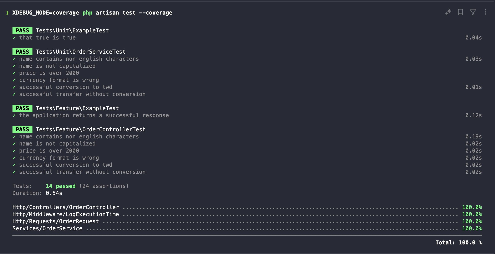

# php-quick-laravel

Feature
1. Feature 1: 訂單格式檢查和轉換
   - 有一支 endpoint 為 POST /api/orders 的 API
   - 使用 FromRequest 來驗證基礎輸入的資料
2. Feature 2: phpInfo 檢查
   - GET /api/phpinfo
3. Feature 3: rawSQL 執行驗證(需搭配語法指令建立資料庫)
   - GET /api/rawSQL

## Getting Started
### Prerequisites

- [PHP] (Version 8.3 or later)
- [Docker](https://www.docker.com/get-started)

### Running Locally

To run the project locally for debugging purposes, follow these steps:
1. **Clone project 並且移動至根目錄**
    ```bash
    git clone https://github.com/sheginabo/php-quick-laravel.git && cd php-quick-laravel
    ```
2. **給予懶人腳本權限**
    ```bash
    chmod +x ./docker/build_local.sh
    chmod +x ./docker/build_deploy.sh
    ```
3. **懶人腳本解說**
    ```
    build_local.sh
    ```
   - 建立一組 Container 將project 掛進去執行環境方便改 Code (極致低配 Laradock)
    ```
    build_deploy.sh
    ```
   - 建立一組 Container 將開發完成的專案放進 image (丟 ECR 或是 DockerHub 之前本地檢查品質)
4. **位於專案根目錄執行 build_deploy.sh 驗證包成 image**
    ```bash
    ./docker/build_deploy.sh
    ```
5. **完成會提示可以透過 http://localhost:8080, http://localhost:8080/api/orders 驗證**
6. **相關檔案單元測試和功能測試結果**
   

### 資料庫簡單實作(題目一)
DBML link [dbdiagram.io](https://dbdiagram.io/d/simpleBNB-67098d4097a66db9a3b56a40)
假設要設計一條 SQL 列出在 2023 年 5 月下訂的訂單, 並且要 GroupBy 要 Join 要 Sum, 這個架構下 orders Table 的資料量會是最多的, 
我會選用以下 SQL
```sql
    SELECT
        temp.bnb_id,
        b.name AS bnb_name,
        temp.may_amount
    FROM
        (
            SELECT
                o.bnb_id,
                SUM(o.amount) AS may_amount
            FROM
                orders o
            WHERE
                o.currency = 'TWD'
              AND o.created_at >= '2023-05-01'
              AND o.created_at < '2023-06-01'
            GROUP BY
                o.bnb_id
            ORDER BY
                may_amount DESC
                LIMIT 10
        ) AS temp
            JOIN
        bnbs b ON temp.bnb_id = b.id;
```
優點：
1. 子查詢先篩選和聚合:
    在子查詢中，先對 orders 表進行篩選（WHERE 子句）、聚合（SUM 和 GROUP BY）和排序（ORDER BY），然後只選取前 10 條記錄。這意味著只有這 10 條記錄需要與 bnbs 表進行 JOIN 操作。
2. 限制日期範圍:
    使用 WHERE 子句限制了日期範圍（2023年5月），這可以大大減少需要處理的記錄數量。
3. 只選擇必要的列:
    查詢只選擇了必要的列（bnb_id 和 amount），而不是選擇所有列，這減少了需要處理的數據量。
4. 延遲 JOIN:
    通過先在子查詢中處理 orders 表，然後只對結果進行 JOIN，大大減少了需要 JOIN 的數據量。

這種查詢結構非常適合處理大型表，因為它首先在子查詢中縮小了數據集，然後才進行 JOIN 操作。這樣可以顯著提高查詢效率，特別是在 orders 表非常大的情況下。

### 仍然有效能問題(題目二)
1. 添加 index：
對於頻繁查詢的列添加 index 可以顯著提高查詢速度。
CREATE INDEX idx_orders_bnb_id ON orders(bnb_id);
CREATE INDEX idx_orders_currency ON orders(currency);
CREATE INDEX idx_orders_created_at ON orders(created_at);
CREATE INDEX idx_bnbs_id ON bnbs(id);
2. 考慮複合 index：
如果這個 SQL 很常需要執行：
CREATE INDEX idx_orders_bnb_currency_created ON orders(bnb_id, currency, created_at);
3. 分區表：
如果 orders 表的數據量非常大，可以考慮按時間範圍分區。這樣可以讓查詢只掃描相關的分區，而不是整個表。

4. 定期維護：
定期運行 VACUUM(PostgreSQL) 和 ANALYZE 命令來優化數據庫結構和更新統計信息。
5. 硬體升級：
如果軟體優化後仍然存在效能問題，可以考慮升級硬體，特別是使用 SSD 存儲和增加 RAM。
6. 快取：
對於頻繁執行的查詢，可以考慮使用應用層緩存（如 Redis）來存儲結果。
7. 非正規化：
在某些情況下，可以考慮在 bnbs 表中添加一個月度總額列，並在每次訂單創建時更新。這樣可以避免每次查詢時都需要計算。
監控和分析：
8. 很認真的用 EXPLAIN QUERY 命令來分析語句, 力拼改到 index-only scan

### POST /api/orders

## SOLID 原則展現

**單一職責原則 (SRP):**
- `OrderRequest`: 處理訂單請求的驗證邏輯。
- `OrderController`: 管理 HTTP 請求和回應週期。
- `OrderService`: 包含訂單轉移的業務邏輯。
- `LogExecutionTime`: 這個中間件類只有一個職責，即記錄傳入請求的執行時間。

**開閉原則 (OCP):**
- `OrderService`: 可以透過新增新的驗證或處理邏輯進行擴展，而無需修改現有程式碼。
- `LogExecutionTime`: 這個類可以通過添加額外的日誌記錄功能進行擴展，而無需修改現有代碼。

**里氏替換原則 (LSP):**
- 在提供的程式碼中沒有明確展示，但 Laravel 中使用介面和基底類別通常支��此原則。

**介面隔離原則 (ISP):**
- 在提供的程式碼中沒有明確展示，但 Laravel 使用特定介面處理不同職責支援這項原則。

**依賴反轉原則 (DIP):**
- `OrderController`: 依賴 `OrderService` 抽象化而不是具體實現，以便測試和維護。

## 設計模式展現

**依賴注入:**
- `OrderController`: 透過建構函式將 `OrderService` 注入到控制器中。

**模板方法:**
- `OrderRequest`: `FormRequest` 類別提供了請求驗證的模板，`OrderRequest` 進行擴充和自訂。

**例外處理:**
- `OrderService`: 使用自訂例外 (`TransferOrderException`) 處理特定的驗證錯誤。

**策略模式:**
- `OrderService`: `validateOrderData` 方法可以看成是驗證訂單資料不同方面的策略。

**中間件模式:**
- `LogExecutionTime`: 這個類實現了中間件模式，允許在管道中處理請求和回應。
